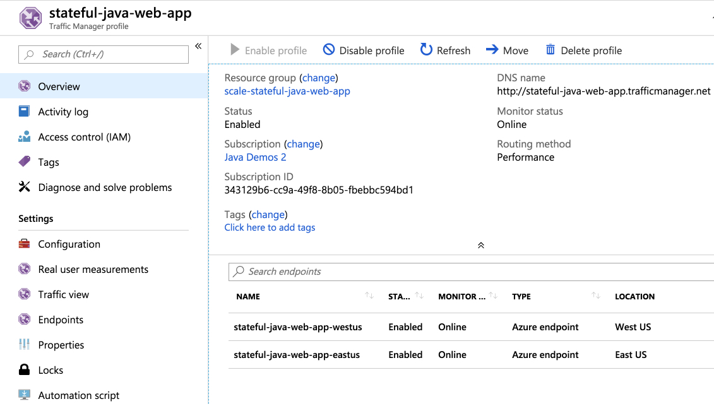
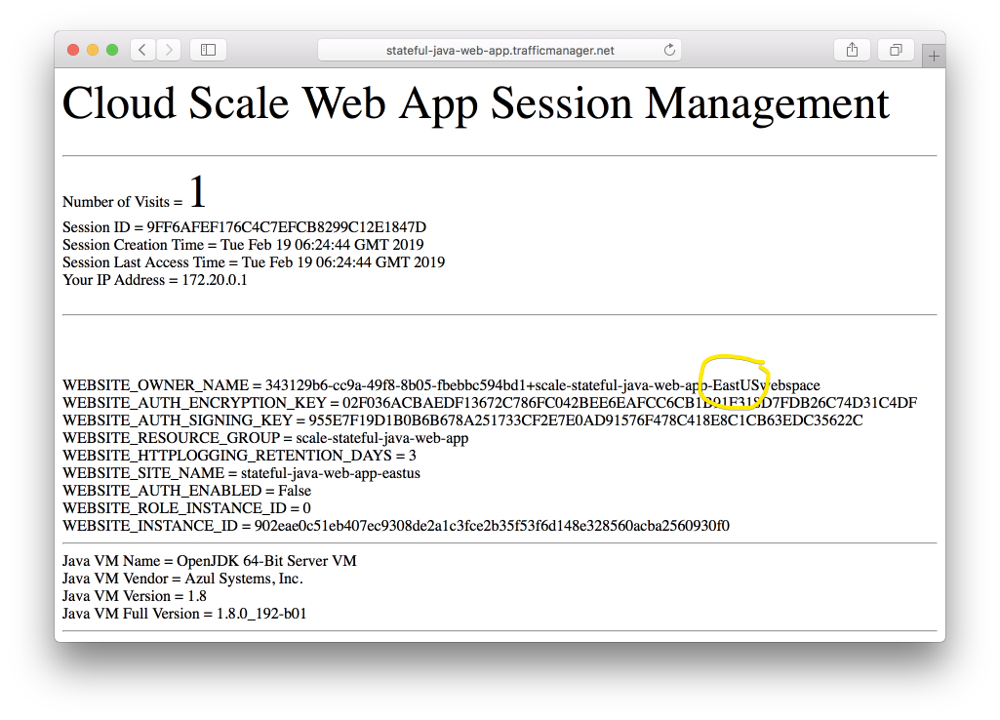
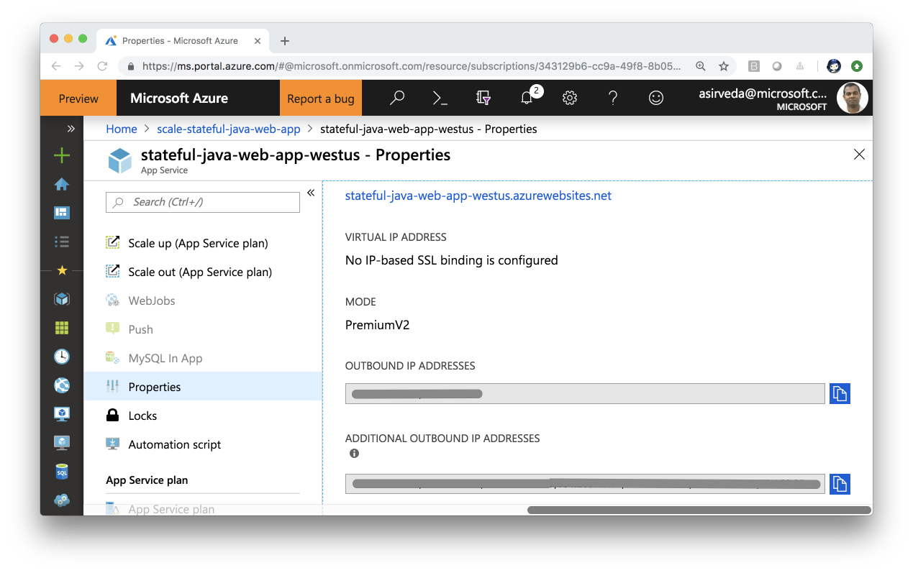
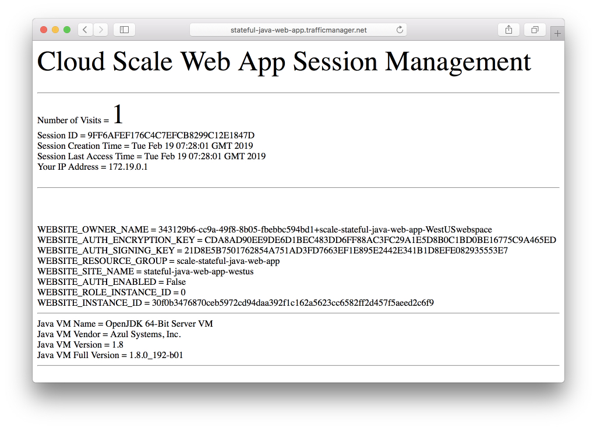
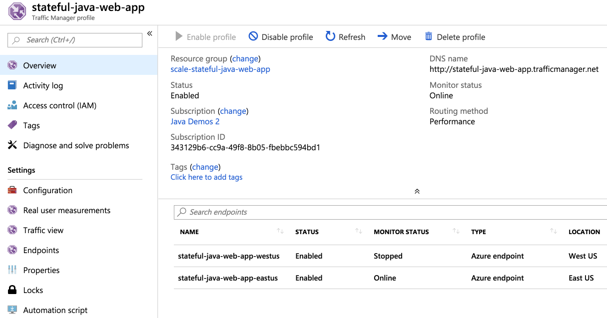
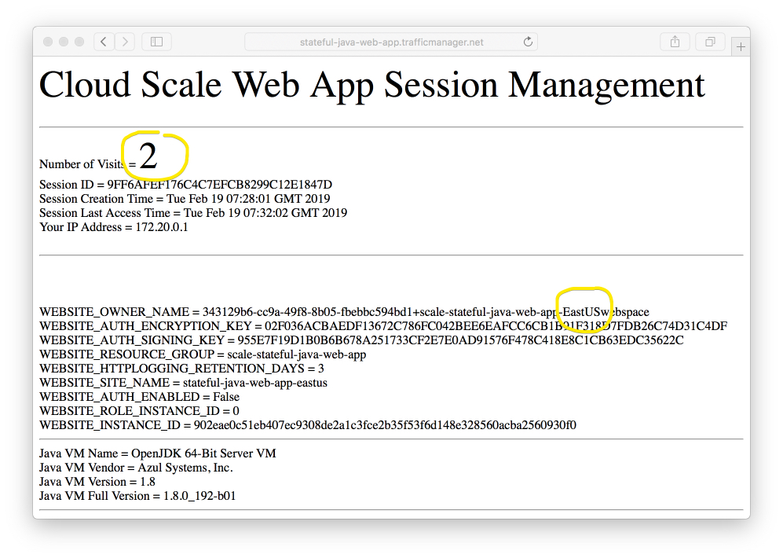

# Scaling Stateful Java Apps on Azure

This guide walks you through the process of scaling 
stateful Java apps on Azure, aka:
 
- Migrate or deploy stateful Java apps to App Service Linux
- Externalize HTTP sessions to Azure Redis Cache 

## Table of Contents

   * [Scaling Stateful Java Apps on Azure](#scaling-stateful-java-apps-on-azure)
      * [Table of Contents](#table-of-contents)
      * [What you will migrate to cloud](#what-you-will-migrate-to-cloud)
      * [What you will need](#what-you-will-need)
      * [Getting Started](#getting-started)
         * [Step ONE - Clone and Prep](#step-one---clone-and-prep)
      * [Build Scalable Layout for Stateful Java Apps on Azure](#build-scalable-layout-for-stateful-java-apps-on-azure)
         * [Build the Stateful Java Web App:](#build-the-stateful-java-web-app)
         * [Deploy the Stateful Java Web App to First Data Center:](#deploy-the-stateful-java-web-app-to-first-data-center)
         * [Deploy the Stateful Java Web App to Second Data Center:](#deploy-the-stateful-java-web-app-to-second-data-center)
         * [Cluster Stateful Java Web Apps Behind Traffic Manager:](#cluster-stateful-java-web-apps-behind-traffic-manager)
      * [Scale Stateful Java Apps on Azure](#scale-stateful-java-apps-on-azure)
         * [Application Composability - Multiple Apps of Service](#application-composability---multiple-apps-of-service)
         * [Application Elasticity](#application-elasticity)
         * [Failover Across Data Centers](#failover-across-data-centers)
         * [Reduced Memory Footprint](#reduced-memory-footprint)
         * [Flexibility of External Data Store](#flexibility-of-external-data-store)
         * [Externalize Sessions to Azure Redis Cache](#externalize-sessions-to-azure-redis-cache)
            * [Create Redis Cache](#create-redis-cache)
            * [Externalize Sessions to Redis Cache](#externalize-sessions-to-redis-cache)
            * [Upload Redis Cache Session Manager Binary to App Service Linux](#upload-redis-cache-session-manager-binary-to-app-service-linux)
               * [Upload Session Manager Binary Artifact to First App through FTP](#upload-session-manager-binary-artifact-to-first-app-through-ftp)
               * [Upload Session Manager Binary Artifact to Second App through FTP](#upload-session-manager-binary-artifact-to-second-app-through-ftp)
            * [Disable Session Affinity Cookie (ARR cookie) for App Service Linux](#disable-session-affinity-cookie-arr-cookie-for-app-service-linux)
            * [Setup Redis Cache Firewall Rules for Java Web Apps](#setup-redis-cache-firewall-rules-for-java-web-apps)
               * [Retrieve Java Web Apps Outbound IP Addresses](#retrieve-java-web-apps-outbound-ip-addresses)
               * [Setup Redis Cache Firewall Rules for Outbound IP Addresses](#setup-redis-cache-firewall-rules-for-outbound-ip-addresses)
            * [Rebuild and Re-deploy the Stateful Java Web App to First Data Center](#rebuild-and-re-deploy-the-stateful-java-web-app-to-first-data-center)
            * [Re-deploy the Stateful Java Web App to Second Data Center](#re-deploy-the-stateful-java-web-app-to-second-data-center)
            * [Open Scaled Stateful Java Web Apps on Azure](#open-scaled-stateful-java-web-apps-on-azure)
      * [Congratulations!](#congratulations)
      * [Resources](#resources)
      * [Contributing](#contributing)

## What you will migrate to cloud

You will migrate stateful Java apps to Azure, scale it 
across geographies
and demo failover across data centers. These
 apps use:

- Java Servlet (JSR 369)
- Java EE 7

Upon migration, you will power the apps using App Service Linux and
Azure Redis Cache.

Migrated Java apps can be hosted anywhere – [virtual machines](https://docs.microsoft.com/en-us/azure/virtual-machines/linux/), 
[containers - AKS](https://docs.microsoft.com/en-us/azure/aks/intro-kubernetes) or 
[managed Tomcat in App Service Linux](https://docs.microsoft.com/en-us/azure/app-service/containers/quickstart-java). 
We chose the managed option. 
The underlying technique for migration is the SAME 
regardless of a choice of where migrated apps are hosted.

## What you will need

In order to deploy a Java Web app to cloud, you need 
an Azure subscription. If you do not already have an Azure 
subscription, you can activate your 
[MSDN subscriber benefits](https://azure.microsoft.com/pricing/member-offers/msdn-benefits-details/) 
or sign up for a 
[free Azure account](https://azure.microsoft.com/pricing/free-trial/).

In addition, you will need the following:

| [Azure CLI](http://docs.microsoft.com/cli/azure/overview) 
| [Java 8](https://www.azul.com/downloads/azure-only/zulu/) 
| [Maven 3](http://maven.apache.org/) 
| [Git](https://github.com/)

## Getting Started

You can start from scratch and complete each step, or 
you can bypass basic setup steps that you are already 
familiar with. Either way, you will end up with working code.

### Step ONE - Clone and Prep

```bash
git clone --recurse-submodules --remote https://github.com/Azure-Samples/scaling-stateful-java-web-app-on-azure
cd scaling-stateful-java-web-app-on-azure
yes | cp -rf .prep/* .
```

## Build Scalable Layout for Stateful Java Apps on Azure

#### Build the Stateful Java Web App:

```bash

# change to initial directory
cd initial/stateful-java-web-app

# build WAR package
mvn package

[INFO] Scanning for projects...
[INFO] 
[INFO] ------------------------------------------------------------------------
[INFO] Building Stateful-Tracker 1.0.0-SNAPSHOT
[INFO] ------------------------------------------------------------------------
[INFO] 
[INFO] --- maven-resources-plugin:2.6:resources (default-resources) @ Stateful-Tracker ---
[INFO] Using 'UTF-8' encoding to copy filtered resources.
[INFO] Copying 1 resource
[INFO] 
[INFO] --- maven-compiler-plugin:3.8.0:compile (default-compile) @ Stateful-Tracker ---
[INFO] Changes detected - recompiling the module!
[INFO] Compiling 2 source files to /Users/selvasingh/scaling-stateful-java-web-app-on-azure/initial/stateful-java-web-app/target/classes
[INFO] 
[INFO] --- maven-resources-plugin:2.6:testResources (default-testResources) @ Stateful-Tracker ---
[INFO] Using 'UTF-8' encoding to copy filtered resources.
[INFO] skip non existing resourceDirectory /Users/selvasingh/scaling-stateful-java-web-app-on-azure/initial/stateful-java-web-app/src/test/resources
[INFO] 
[INFO] --- maven-compiler-plugin:3.8.0:testCompile (default-testCompile) @ Stateful-Tracker ---
[INFO] No sources to compile
[INFO] 
[INFO] --- maven-surefire-plugin:2.12.4:test (default-test) @ Stateful-Tracker ---
[INFO] No tests to run.
[INFO] 
[INFO] --- maven-war-plugin:3.2.2:war (default-war) @ Stateful-Tracker ---
[INFO] Packaging webapp
[INFO] Assembling webapp [Stateful-Tracker] in [/Users/selvasingh/scaling-stateful-java-web-app-on-azure/initial/stateful-java-web-app/target/Stateful-Tracker-1.0.0-SNAPSHOT]
[INFO] Processing war project
[INFO] Copying webapp resources [/Users/selvasingh/scaling-stateful-java-web-app-on-azure/initial/stateful-java-web-app/src/main/webapp]
[INFO] Webapp assembled in [67 msecs]
[INFO] Building war: /Users/selvasingh/scaling-stateful-java-web-app-on-azure/initial/stateful-java-web-app/target/Stateful-Tracker-1.0.0-SNAPSHOT.war
[INFO] ------------------------------------------------------------------------
[INFO] BUILD SUCCESS
[INFO] ------------------------------------------------------------------------
[INFO] Total time: 2.963 s
[INFO] Finished at: 2019-02-18T21:44:22-08:00
[INFO] Final Memory: 20M/308M
[INFO] ------------------------------------------------------------------------

```

#### Deploy the Stateful Java Web App to First Data Center:

Log into Azure using CLI

```bash
az login
```
Set environment variables for binding secrets at runtime, 
particularly: 
- Subscription ID
- Azure Resource Group name 
- Web App Name
- Redis Cache info (OPTIONAL - you may skip for now)
- Traffic Manager info
 
You can 
export them to your local environment, say using the supplied
Bash shell script template.

```bash
cp set-env-variables-template.sh .scripts/set-env-variables.sh
```

Modify `.scripts/set-env-variables.sh` and set Subscription,
Resource Group, Web App, Redis and Traffic Manager info. 
Then, set environment variables:
 
```bash
source .scripts/set-env-variables.sh
```

Deploy to Tomcat on App Service Linux. Add 
[Maven Plugin for Azure App Service](https://github.com/Microsoft/azure-maven-plugins/blob/develop/azure-webapp-maven-plugin/README.md) 
configuration to POM.xml and deploy stateful Java Web app to 
Tomcat in App Service Linux:

```xml
<plugin>
    <groupId>com.microsoft.azure</groupId>
    <artifactId>azure-webapp-maven-plugin</artifactId>
    <version>2.5.0</version>
    <configuration>

        <!-- Web App information -->
    <schemaVersion>v2</schemaVersion>
    <subscriptionId>${SUBSCRIPTION_ID}</subscriptionId>
    <resourceGroup>${RESOURCEGROUP_NAME}</resourceGroup>
    <appName>${WEBAPP_NAME}-${REGION}</appName>
    <pricingTier>P1v2</pricingTier>
    <region>${REGION}</region>
    <appServicePlanName>${WEBAPP_PLAN_NAME}-${REGION}</appServicePlanName>
    <appServicePlanResourceGroup>${RESOURCEGROUP_NAME}</appServicePlanResourceGroup>
    <runtime>
        <os>Linux</os>
        <javaVersion>Java 8</javaVersion>
        <webContainer>Tomcat 9.0</webContainer>
    </runtime>
    <deployment>
        <resources>
        <resource>
            <directory>${project.basedir}/target</directory>
            <includes>
            <include>*.war</include>
            </includes>
        </resource>
        </resources>
    </deployment>
        <appSettings>
            <property>
                <name>JAVA_OPTS</name>
                <value>-Xms2048m -Xmx2048m</value>
            </property>
        </appSettings>

    </configuration>
</plugin>
```

Deploy to Tomcat in App Service Linux, first data center:

```bash
mvn azure-webapp:deploy -DREGION=${REGION_1}

[INFO] Scanning for projects...
[INFO] 
[INFO] ------------------------------------------------------------------------
[INFO] Building Stateful-Tracker 1.0.0-SNAPSHOT
[INFO] ------------------------------------------------------------------------
[INFO] 
[INFO] --- azure-webapp-maven-plugin:1.5.3:deploy (default-cli) @ Stateful-Tracker ---
[INFO] Authenticate with Azure CLI 2.0
[INFO] Target Web App doesn't exist. Creating a new one...
[INFO] Creating App Service Plan 'stateful-java-web-app-appservice-plan-westus'...
[INFO] Successfully created App Service Plan.
[INFO] Successfully created Web App.
[INFO] Trying to deploy artifact to stateful-java-web-app-westus...
[INFO] Deploying the war file...
[INFO] Successfully deployed the artifact to https://stateful-java-web-app-westus.azurewebsites.net
[INFO] ------------------------------------------------------------------------
[INFO] BUILD SUCCESS
[INFO] ------------------------------------------------------------------------
[INFO] Total time: 01:09 min
[INFO] Finished at: 2019-02-18T22:03:14-08:00
[INFO] Final Memory: 54M/546M
[INFO] ------------------------------------------------------------------------
```

#### Deploy the Stateful Java Web App to Second Data Center:

Deploy to Tomcat in App Service Linux, first data center:

```bash
mvn azure-webapp:deploy -DREGION=${REGION_2}

[INFO] Scanning for projects...
[INFO] 
[INFO] ------------------------------------------------------------------------
[INFO] Building Stateful-Tracker 1.0.0-SNAPSHOT
[INFO] ------------------------------------------------------------------------
[INFO] 
[INFO] --- azure-webapp-maven-plugin:1.5.3:deploy (default-cli) @ Stateful-Tracker ---
[INFO] Authenticate with Azure CLI 2.0
[INFO] Target Web App doesn't exist. Creating a new one...
[INFO] Creating App Service Plan 'stateful-java-web-app-appservice-plan-eastus'...
[INFO] Successfully created App Service Plan.
[INFO] Successfully created Web App.
[INFO] Trying to deploy artifact to stateful-java-web-app-eastus...
[INFO] Deploying the war file...
[INFO] Successfully deployed the artifact to https://stateful-java-web-app-eastus.azurewebsites.net
[INFO] ------------------------------------------------------------------------
[INFO] BUILD SUCCESS
[INFO] ------------------------------------------------------------------------
[INFO] Total time: 03:51 min
[INFO] Finished at: 2019-02-18T22:09:11-08:00
[INFO] Final Memory: 55M/648M
[INFO] ------------------------------------------------------------------------
```

#### Cluster Stateful Java Web Apps Behind Traffic Manager:

Create Traffic Manager and cluster these stateful Java Web apps behind
the Traffic Manager.

```bash

# create traffic manager profile
az network traffic-manager profile create \
    --resource-group ${RESOURCEGROUP_NAME} \
    --name ${TRAFFIC_MANAGER_PROFILE_NAME} \
    --routing-method Weighted \
    --unique-dns-name ${TRAFFIC_MANAGER_DNS_NAME} \
    --ttl 30 --protocol HTTP --port 80 --path "/"

# create first endpoint
az network traffic-manager endpoint create \
    --resource-group ${RESOURCEGROUP_NAME} \
    --profile-name ${TRAFFIC_MANAGER_PROFILE_NAME} \
    --name ${WEBAPP_NAME}-${REGION_1} \
    --type azureEndpoints \
    --target-resource-id ${TARGET_RESOURCE_ID_1} \
    --weight 50 \
    --endpoint-status enabled

# create second endpoint
az network traffic-manager endpoint create \
    --resource-group ${RESOURCEGROUP_NAME} \
    --profile-name ${TRAFFIC_MANAGER_PROFILE_NAME} \
    --name ${WEBAPP_NAME}-${REGION_2} \
    --type azureEndpoints \
    --target-resource-id ${TARGET_RESOURCE_ID_2} \
    --weight 50 \
    --endpoint-status enabled
```

Traffic manager profile should look like this:



```bash
# open the traffic manager
open http://stateful-java-web-app.trafficmanager.net
```


Let's stop one of the stateful Java Web app and check how 
failover happens:

```bash
az webapp stop -g ${RESOURCEGROUP_NAME} -n ${WEBAPP_NAME}-${REGION_1}
```

Failover failed because the session tracking begins from scratch,
particularly, once the connection breaks, the client 
is round robined to another server in East US data center,
then the correlation is lost.



Restart the stopped server:

```bash
az webapp start -g ${RESOURCEGROUP_NAME} -n ${WEBAPP_NAME}-${REGION_1}
```

## Scale Stateful Java Apps on Azure

External data stores, such as Redis Cache, Mongo DB or MySQL, 
can be used as an external cache for containers, such as Spring Boot, 
Tomcat and WildFly/JBoss. This allows external data store to store 
HTTP Sessions, among other data, independent of the application layer, 
which provides multiple benefits:

#### Application Composability - Multiple Apps of Service

By externalizing sessions and using multiple apps that form a service and 
bouncing users across these apps, you
can realize scenarios such as shopping cart state 
traveling with users as they navigate experiences
through multiple apps.

#### Application Elasticity

By making the application stateless additional Web apps may be added to 
the service cluster without expensive data rebalancing operations. The 
service cluster may also be replaced without downtime by keeping the 
state in the external data store, as upgraded Web apps may be brought 
online and retrieve the sessions.

#### Failover Across Data Centers

Should a data center become unavailable the session data persists, 
as it is stored safely within the external data store. This allows a 
load balancer to redirect incoming requests to a second cluster to 
retrieve the session information.

#### Reduced Memory Footprint

There is reduced memory pressure, resulting in shorter garbage 
collection time and frequency of collections, as the HTTP Sessions 
have been moved out of the application layer and into the backing caches.

#### Flexibility of External Data Store

External data store such as Azure Redis Cache is available in 
[multiple tiers](https://docs.microsoft.com/en-us/azure/azure-cache-for-redis/cache-overview#azure-cache-for-redis-offerings). 
“Premium tier Caches support more features and have higher throughput with 
lower latencies.” See [What Azure Cache for Redis offering and size should I use?](https://docs.microsoft.com/en-us/azure/azure-cache-for-redis/cache-faq#what-azure-cache-for-redis-offering-and-size-should-i-use)

### Externalize Sessions to Azure Redis Cache

#### Create Redis Cache

```bash

# create redis cache
az redis create \
    --name ${REDIS_CACHE_NAME} \
    --resource-group ${RESOURCEGROUP_NAME} \
    --location ${REGION_1} \
    --vm-size C1 --sku Standard \
    --enable-non-ssl-port

az redis show \
    --name ${REDIS_CACHE_NAME} \
    --resource-group ${RESOURCEGROUP_NAME}

# get redis password
az redis list-keys \
    --name ${REDIS_CACHE_NAME} \
    --resource-group ${RESOURCEGROUP_NAME}

{
  "primaryKey": "======= MASKED =======",
  "secondaryKey": "======= MASKED ======="
}
    
```

Copy the primary key and set it as `REDIS_PASSWORD` in the 
'.scripts/set-env-variables.sh' file and export it to the
environment.

```bash
source .scripts/set-env-variables.sh
```

#### Externalize Sessions to Redis Cache

Configure Tomcat's 'src/main/webapp/META-INF/context.xml' to 
externalize sessions to Redis Cache:

```xml
<?xml version="1.0" encoding="UTF-8"?>
<Context path="">
    <!-- Specify Redis Store -->
    <Valve className="com.gopivotal.manager.SessionFlushValve" />
    <Manager className="org.apache.catalina.session.PersistentManager">
        <Store className="com.gopivotal.manager.redis.RedisStore"
               connectionPoolSize="20"
               host="${REDIS_CACHE_NAME}.redis.cache.windows.net"
               port="${REDIS_PORT}"
               password="${REDIS_PASSWORD}"
               sessionKeyPrefix="${REDIS_SESSION_KEY_PREFIX}"
               timeout="2000"
        />
    </Manager>
</Context>
```

Create an XML file 'context.xml' with the above contents in 
the 'src/main/webapp/META-INF/' directory.

#### Upload Redis Cache Session Manager Binary to App Service Linux

We will use 
[Pivotal Session Manager - Redis Store](https://github.com/pivotalsoftware/session-managers/tree/master/redis-store)
to externalize sessions. Upload Pivotal Session Manage to 
App Service Linux. You can find the JAR at the 
[Pivotal GitHub Repo](https://github.com/pivotalsoftware/session-managers/tree/master/redis-store). 
For your convenience, you will find the JAR in [initial/stateful-java-web-app/.scripts](https://github.com/selvasingh/scaling-stateful-java-web-app-on-azure/tree/master/.prep/initial/stateful-java-web-app/.scripts) folder.

##### Upload Session Manager Binary Artifact to First App through FTP

Use Azure CLI to get FTP deployment credentials:

```bash
az webapp deployment list-publishing-profiles -g ${RESOURCEGROUP_NAME} -n ${WEBAPP_NAME}-${REGION_1}

[
   ...
    "profileName": "stateful-java-web-app-eastus - FTP",
    "publishMethod": "FTP",
    "publishUrl": "ftp://waws-prod-blu-089.ftp.azurewebsites.windows.net/site/wwwroot",
    "userName": "stateful-java-web-app-eastus\\$stateful-java-web-app-eastus",
    "userPWD": "======= MASKED =======",
    "webSystem": "WebSites"
  }
]

```

Open an FTP connection to App Service Linux to upload artifacts:

```bash
cd .scripts

ftp> open waws-prod-blu-089.ftp.azurewebsites.windows.net
Trying 52.168.126.86...
Connected to waws-prod-blu-089.drip.azurewebsites.windows.net.
220 Microsoft FTP Service
Name (waws-prod-blu-089.ftp.azurewebsites.windows.net:selvasingh): stateful-java-web-app-eastus\\$stateful-java-web-app-eastus
331 Password required
Password:
230 User logged in.
Remote system type is Windows_NT.
ftp> mkdir tomcat
257 "tomcat" directory created.
ftp> cd tomcat
250 CWD command successful.
ftp> mkdir lib
257 "lib" directory created.
ftp> cd lib
250 CWD command successful.
ftp> bin
200 Type set to I.
ftp> put redis-store-1.3.2.RELEASE.jar
local: redis-store-1.3.2.RELEASE.jar remote: redis-store-1.3.2.RELEASE.jar
229 Entering Extended Passive Mode (|||10167|)
125 Data connection already open; Transfer starting.
100% |*********************************************************|   794 KiB  563.15 KiB/s    00:00 ETA
226 Transfer complete.
813185 bytes sent in 00:01 (498.59 KiB/s)
ftp> bye
221 Goodbye.

```

##### Upload Session Manager Binary Artifact to Second App through FTP

Similarly, upload session manager binary artifact to second app:

```bash

az webapp deployment list-publishing-profiles -g ${RESOURCEGROUP_NAME} -n ${WEBAPP_NAME}-${REGION_2}

...

ftp> open waws-prod-blu-089.ftp.azurewebsites.windows.net
...
ftp> put redis-store-1.3.2.RELEASE.jar
local: redis-store-1.3.2.RELEASE.jar remote: redis-store-1.3.2.RELEASE.jar
229 Entering Extended Passive Mode (|||10167|)
125 Data connection already open; Transfer starting.
100% |*********************************************************|   794 KiB  563.15 KiB/s    00:00 ETA
226 Transfer complete.
813185 bytes sent in 00:01 (498.59 KiB/s)
ftp> bye
221 Goodbye.

```

#### Disable Session Affinity Cookie (ARR cookie) for App Service Linux

```bash
az webapp update -g ${RESOURCEGROUP_NAME} -n ${WEBAPP_NAME}-${REGION_1} --client-affinity-enabled false
az webapp update -g ${RESOURCEGROUP_NAME} -n ${WEBAPP_NAME}-${REGION_2} --client-affinity-enabled false
```

#### Setup Redis Cache Firewall Rules for Java Web Apps

Setup Redis Cache firewall rules for Java Web apps to access the cache.

##### Retrieve Java Web Apps Outbound IP Addresses

You can get a list of possible outbound IP addresses for 
Java Web Apps using the Azure Portal - Web App => Properties:



Each Web app has 9 possible outbound IP address. Write them down for both
Java Web apps.

##### Setup Redis Cache Firewall Rules for Outbound IP Addresses

Use Azure CLI to create Redis Cache firewall rules for all 
18 possible outbound IP addresses:

```bash
# firewall rules for the first Java Web app
az redis firewall-rules create \
    --name ${REDIS_CACHE_NAME} \
    --resource-group ${RESOURCEGROUP_NAME} \
    --rule-name ${WEBAPP_NAME}-${REGION_1}-IP1 \
    --start-ip <ip-address-1> \
    --end-ip <ip-address-1>
...
...
az redis firewall-rules create \
    --name ${REDIS_CACHE_NAME} \
    --resource-group ${RESOURCEGROUP_NAME} \
    --rule-name ${WEBAPP_NAME}-${REGION_1}-IP9 \
    --start-ip <ip-address-9> \
    --end-ip <ip-address-9>
        
# firewall rules for the second Java Web app
az redis firewall-rules create \
    --name ${REDIS_CACHE_NAME} \
    --resource-group ${RESOURCEGROUP_NAME} \
    --rule-name ${WEBAPP_NAME}-${REGION_2}-IP1 \
    --start-ip <ip-address-1> \
    --end-ip <ip-address-1>
...
...
az redis firewall-rules create \
    --name ${REDIS_CACHE_NAME} \
    --resource-group ${RESOURCEGROUP_NAME} \
    --rule-name ${WEBAPP_NAME}-${REGION_2}-IP9 \
    --start-ip <ip-address-9> \
    --end-ip <ip-address-9>

```

#### Rebuild and Re-deploy the Stateful Java Web App to First Data Center

```bash
mvn package

[INFO] Scanning for projects...
[INFO] 
[INFO] ------------------------------------------------------------------------
[INFO] Building Stateful-Tracker 1.0.0-SNAPSHOT
[INFO] ------------------------------------------------------------------------
[INFO] 
[INFO] --- maven-resources-plugin:2.6:resources (default-resources) @ Stateful-Tracker ---
[INFO] Using 'UTF-8' encoding to copy filtered resources.
[INFO] Copying 1 resource
[INFO] 
[INFO] --- maven-compiler-plugin:3.8.0:compile (default-compile) @ Stateful-Tracker ---
[INFO] Changes detected - recompiling the module!
[INFO] Compiling 2 source files to /Users/selvasingh/scaling-stateful-java-web-app-on-azure/initial/stateful-java-web-app/target/classes
[INFO] 
[INFO] --- maven-resources-plugin:2.6:testResources (default-testResources) @ Stateful-Tracker ---
[INFO] Using 'UTF-8' encoding to copy filtered resources.
[INFO] skip non existing resourceDirectory /Users/selvasingh/scaling-stateful-java-web-app-on-azure/initial/stateful-java-web-app/src/test/resources
[INFO] 
[INFO] --- maven-compiler-plugin:3.8.0:testCompile (default-testCompile) @ Stateful-Tracker ---
[INFO] No sources to compile
[INFO] 
[INFO] --- maven-surefire-plugin:2.12.4:test (default-test) @ Stateful-Tracker ---
[INFO] No tests to run.
[INFO] 
[INFO] --- maven-war-plugin:3.2.2:war (default-war) @ Stateful-Tracker ---
[INFO] Packaging webapp
[INFO] Assembling webapp [Stateful-Tracker] in [/Users/selvasingh/scaling-stateful-java-web-app-on-azure/initial/stateful-java-web-app/target/Stateful-Tracker-1.0.0-SNAPSHOT]
[INFO] Processing war project
[INFO] Copying webapp resources [/Users/selvasingh/scaling-stateful-java-web-app-on-azure/initial/stateful-java-web-app/src/main/webapp]
[INFO] Webapp assembled in [131 msecs]
[INFO] Building war: /Users/selvasingh/scaling-stateful-java-web-app-on-azure/initial/stateful-java-web-app/target/Stateful-Tracker-1.0.0-SNAPSHOT.war
[INFO] ------------------------------------------------------------------------
[INFO] BUILD SUCCESS
[INFO] ------------------------------------------------------------------------
[INFO] Total time: 2.330 s
[INFO] Finished at: 2019-02-18T23:01:36-08:00
[INFO] Final Memory: 18M/214M
[INFO] ------------------------------------------------------------------------

```

Update the `pom.xml` to upload app settings, particularly secrets
to connect with Azure Redis Cache:

```xml
<plugin>
    <groupId>com.microsoft.azure</groupId>
             <artifactId>azure-webapp-maven-plugin</artifactId>
             <version>1.5.3</version>
             <configuration>
         
                 <!-- Web App information -->
                 <resourceGroup>${RESOURCEGROUP_NAME}</resourceGroup>
                 <appServicePlanName>${WEBAPP_PLAN_NAME}-${REGION}</appServicePlanName>
                 <appName>${WEBAPP_NAME}-${REGION}</appName>
                 <region>${REGION}</region>
                 <linuxRuntime>tomcat 9.0-jre8</linuxRuntime>
         
                 <appSettings>
                     <property>
                         <name>REDIS_CACHE_NAME</name>
                         <value>${REDIS_CACHE_NAME}</value>
                     </property>
                     <property>
                         <name>REDIS_PORT</name>
                         <value>${REDIS_PORT}</value>
                     </property>
                     <property>
                         <name>REDIS_PASSWORD</name>
                         <value>${REDIS_PASSWORD}</value>
                     </property>
                     <property>
                         <name>REDIS_SESSION_KEY_PREFIX</name>
                         <value>${REDIS_SESSION_KEY_PREFIX}</value>
                     </property>
                     <property>
                         <name>JAVA_OPTS</name>
                         <value>-Xms2048m -Xmx2048m -DREDIS_CACHE_NAME=${REDIS_CACHE_NAME} -DREDIS_PORT=${REDIS_PORT} -DREDIS_PASSWORD=${REDIS_PASSWORD} -DREDIS_SESSION_KEY_PREFIX=${REDIS_SESSION_KEY_PREFIX}</value>
                     </property>
         
                 </appSettings>
         
             </configuration>
         </plugin>
```

Re-deploy the stateful Java Web app to the first data center:

```bash
mvn azure-webapp:deploy -DREGION=${REGION_1}

[INFO] Scanning for projects...
[INFO] 
[INFO] ------------------------------------------------------------------------
[INFO] Building Stateful-Tracker 1.0.0-SNAPSHOT
[INFO] ------------------------------------------------------------------------
[INFO] 
[INFO] --- azure-webapp-maven-plugin:1.5.3:deploy (default-cli) @ Stateful-Tracker ---
[INFO] Authenticate with Azure CLI 2.0
[INFO] Updating target Web App...
[INFO] Successfully updated Web App.
[INFO] Trying to deploy artifact to stateful-java-web-app-westus...
[INFO] Deploying the war file...
[INFO] Successfully deployed the artifact to https://stateful-java-web-app-westus.azurewebsites.net
[INFO] ------------------------------------------------------------------------
[INFO] BUILD SUCCESS
[INFO] ------------------------------------------------------------------------
[INFO] Total time: 55.494 s
[INFO] Finished at: 2019-02-18T23:11:31-08:00
[INFO] Final Memory: 68M/646M
[INFO] ------------------------------------------------------------------------


# stop and start the first app
az webapp stop -g ${RESOURCEGROUP_NAME} -n ${WEBAPP_NAME}-${REGION_1}
az webapp start -g ${RESOURCEGROUP_NAME} -n ${WEBAPP_NAME}-${REGION_1}

```

#### Re-deploy the Stateful Java Web App to Second Data Center

Similarly, redeploy the stateful Java Web app to second data center:

```bash
mvn azure-webapp:deploy -DREGION=${REGION_2}

[INFO] Scanning for projects...
[INFO] 
[INFO] ------------------------------------------------------------------------
[INFO] Building Stateful-Tracker 1.0.0-SNAPSHOT
[INFO] ------------------------------------------------------------------------
[INFO] 
[INFO] --- azure-webapp-maven-plugin:1.5.3:deploy (default-cli) @ Stateful-Tracker ---
[INFO] Authenticate with Azure CLI 2.0
[INFO] Updating target Web App...
[INFO] Successfully updated Web App.
[INFO] Trying to deploy artifact to stateful-java-web-app-eastus...
[INFO] Deploying the war file...
[INFO] Successfully deployed the artifact to https://stateful-java-web-app-eastus.azurewebsites.net
[INFO] ------------------------------------------------------------------------
[INFO] BUILD SUCCESS
[INFO] ------------------------------------------------------------------------
[INFO] Total time: 50.840 s
[INFO] Finished at: 2019-02-18T23:24:16-08:00
[INFO] Final Memory: 67M/645M
[INFO] ------------------------------------------------------------------------

# stop and start the first app
az webapp stop -g ${RESOURCEGROUP_NAME} -n ${WEBAPP_NAME}-${REGION_2}
az webapp start -g ${RESOURCEGROUP_NAME} -n ${WEBAPP_NAME}-${REGION_2}

```

#### Open Scaled Stateful Java Web Apps on Azure

Open the Traffic Manager profile endpoint:

```bash
open http://stateful-java-web-app.trafficmanager.net
```


Let us stop one of the stateful Java Web app and check how 
failover happens:

```bash
az webapp stop -g ${RESOURCEGROUP_NAME} -n ${WEBAPP_NAME}-${REGION_1}
```

Traffic Manager Profile should look like this:



Refresh the browser:



Failover SUCCEEDED because the session tracking begins,
particularly, once the connection breaks, the client 
is round robined to another server in East US data center,
then the correlation is continued, tracks to `Number of Visits = 2`, 
using externalized sessions.

When you are finished, you can check your results 
against YOUR code in 
[scaling-stateful-java-web-app-on-azure/complete](https://github.com/Azure-Samples/scaling-stateful-java-web-app-on-azure/tree/master/complete).

## Congratulations!

Congratulations!! You migrated 
existing Java enterprise workloads to Azure, aka stateful Java app to App Service Linux and 
app's externalized session store to Azure Redis Cache.

## Resources

- [Servlets - Session Tracking](https://www.tutorialspoint.com/servlets/servlets-session-tracking.htm)
- [Persistent Sessions](https://www.oxxus.net/tutorials/tomcat/persistent-sessions)
- [Scaling Stateful Services](https://www.infoq.com/news/2015/11/scaling-stateful-services)
- [Pivotal Session Managers: redis-store](https://github.com/pivotalsoftware/session-managers/tree/master/redis-store)
- [Externalize Sessions](https://access.redhat.com/documentation/en-us/red_hat_data_grid/7.1/html/administration_and_configuration_guide/externalize_sessions)
- [Cloud Scale Azure Redis Cache](https://docs.microsoft.com/en-us/azure/azure-cache-for-redis/cache-overview#azure-cache-for-redis-offerings)
- [Java Developer Guide for App Service on Linux](https://docs.microsoft.com/en-us/azure/app-service/containers/app-service-linux-java)
- [Maven Plugin for Azure App Service](https://docs.microsoft.com/en-us/java/api/overview/azure/maven/azure-webapp-maven-plugin/readme?view=azure-java-stable)
- [Opening an SSH connection from your development machine](https://docs.microsoft.com/en-us/azure/app-service/containers/app-service-linux-ssh-support#open-ssh-session-from-remote-shell)
- [Azure for Java Developers](https://docs.microsoft.com/en-us/java/azure/)


## Contributing

This project welcomes contributions and suggestions.  Most contributions require you to agree to a
Contributor License Agreement (CLA) declaring that you have the right to, and actually do, grant us
the rights to use your contribution. For details, visit https://cla.microsoft.com.

When you submit a pull request, a CLA-bot will automatically determine whether you need to provide
a CLA and decorate the PR appropriately (e.g., label, comment). Simply follow the instructions
provided by the bot. You will only need to do this once across all repos using our CLA.

This project has adopted the [Microsoft Open Source Code of Conduct](https://opensource.microsoft.com/codeofconduct/).
For more information see the [Code of Conduct FAQ](https://opensource.microsoft.com/codeofconduct/faq/) or
contact [opencode@microsoft.com](mailto:opencode@microsoft.com) with any additional questions or comments.
